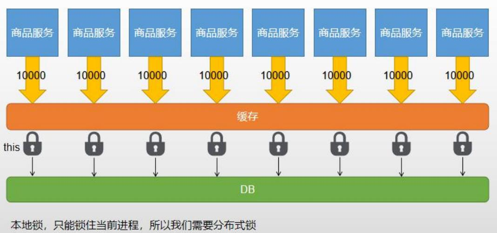
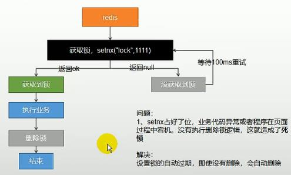
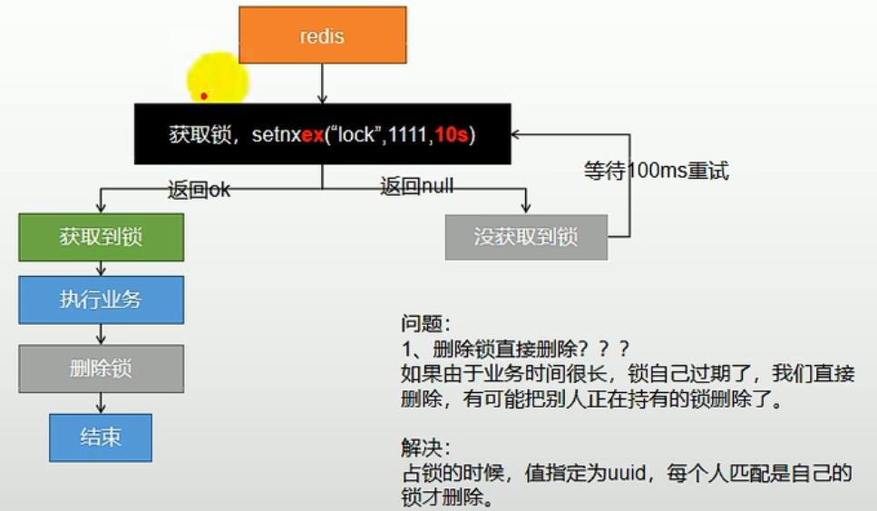

## 锁🔒
使用redis作为缓存存在缓存穿透、缓存雪崩和缓存击穿的问题
- **缓存穿透**是指查询一个一定不存在的键值，由于缓存中不命中，将去查询数据库，数据库中也没有该记录，而一般情况下我们也不会将
null 存入到缓存中，因此每次的请求都会达到数据库上，缓存失去意义，这种类型的请求量大时，数据库很可能挂掉
> 解决方法：将空结果放入到缓存中，并设置较短的过期时间
- **缓存雪崩**是指我们在设置缓存时采用了相同的过期时间，导致缓存在某一时刻同时失效，请求全部打到数据库上，数据库被打挂
> 解决方法：过期时间设置为一个随机值，这样在同一时刻缓存集体失效的概率会大大降低
- **缓存击穿**是指对于一些设置了过期时间的热点数据，如果大量请求前热点数据过期，那么缓存将被击穿，大量请求直接打到数据库上
> 解决方法：**加锁**

锁又分成了本地锁和分布式锁，详细说明如下：



由于springboot中的所有组件在容器中都是单例的，因此我们可以使用`synchronized(this){...}`代码块来实现本地锁，但其弊端是只能够锁住当前进程，对于单体应用
肯定是没有问题，即使是1000万个请求也只会有一条进入数据库；但是对于分布式服务，多个实例，本地锁只能锁住当前的进程，即每个实例都会上一把所，对于1000万
的请求，比如我们负载均衡到100个实例上，那么就会有100个请求打到数据库上，如果在分布式服务中，想要所有的请求只访问一次数据库，此时便用到了分布式锁

```java
// 本地锁的代码示例
public List<CategoryEntity> listTreeCategoryWithLocalLock() {
        // 因为springboot中的所有组件在容器中都是单例的，所以可以这么写，因为即使有100个请求，他们使用的都是这一个实例对象
        synchronized (this) {
            // 1. 得到锁之后，我们需要判断一下缓存中是否存在
            String dataFromCache = stringRedisTemplate.opsForValue().get("category_tree");
            if (StringUtils.hasLength(dataFromCache)) {
                return JSON.parseObject(dataFromCache, new TypeReference<List<CategoryEntity>>() {
                });
            }

            // 业务逻辑
            // ...

            // 2. 必须要将写入缓存也放入到同步块中
            if (entities.isEmpty()) {
                // 将空值也加入缓存解决缓存穿透，并设置随机过期时间解决缓存雪崩
                stringRedisTemplate.opsForValue().set("category_tree", "", new Random().nextInt(100), TimeUnit.SECONDS);
            } else {
                // 将数据转成json格式的字符串
                String str = JSON.toJSONString(entities);
                stringRedisTemplate.opsForValue().set("category_tree", str);
            }

            return entities;
        }
    }
```

分布式锁相当于对整个缓存做了一次加锁操作，每次请求进来之前都要先去获得锁，否则只能被阻塞等待，因此分布式锁相较于本地锁，性能是较差的

redis中加入分布式锁主要是使用的一个命令 `SET key value [EX seconds|PX milliseconds|...] [NX|XX]`，值得注意的是NX指的是不存在key的时候更新值，XX指的是存在key的时候更新值
分布式锁的实现过程还是有不少坑的，这里做一下记录：

（执行业务阶段包含了查询缓存，查询数据库，写入缓存这几个过程）

1. 如果我们按照下图的顺序实现分布式锁，可能会出现死锁的情况.
原因在于如果由于程序异常退出等原因导致锁没有被删除掉，那么后面的请求将一直无法获取到这个锁，一直处于自旋状态，请求的不到响应

    > 解决方法就是给分布式锁加上过期时间
    
    

2. 修改掉上面的问题之后，不会再出现死锁的问题，但是可能出现这样的情况：由于业务代码执行时间较长，锁由于到达了过期时间自动消失了，此时会有新的请求占有这个锁，
当前一个请求的业务代码执行完后，后执行删除操作，此时会把后一个请求的锁删除掉，如此往复...
    
    > 解决方法是占锁的时候使用UUID来标识，每个请求只能够删除自己的锁
    
             
    
3. 但是为了解决请求误删其他请求的锁的问题，不能只单纯依靠UUID，因为锁可能会过期，比如当前请求访问redis服务器的时候锁还没有过期，但是在传输响应结果到web端的过程中锁过期了，此时立刻会有其他请求抢占锁，而我们比较传输结果成功之后，会删除锁，此时删除的就是别的请求的锁

    > 其实为了解决这个问题，我想的办法是抢占锁时，过期时间设置为 当前时间+一个时间段，比较的时候用来比较当前时间是否在过期时间之后
                                                                               
    除此之外，还有一种方法是 结合lua脚本，保证判断和删除锁的原子性
    
其实，自己实现分布式锁的重点就在于**加锁和解锁都要实现原子性**
                                                                                                                                                                                                                                                                             